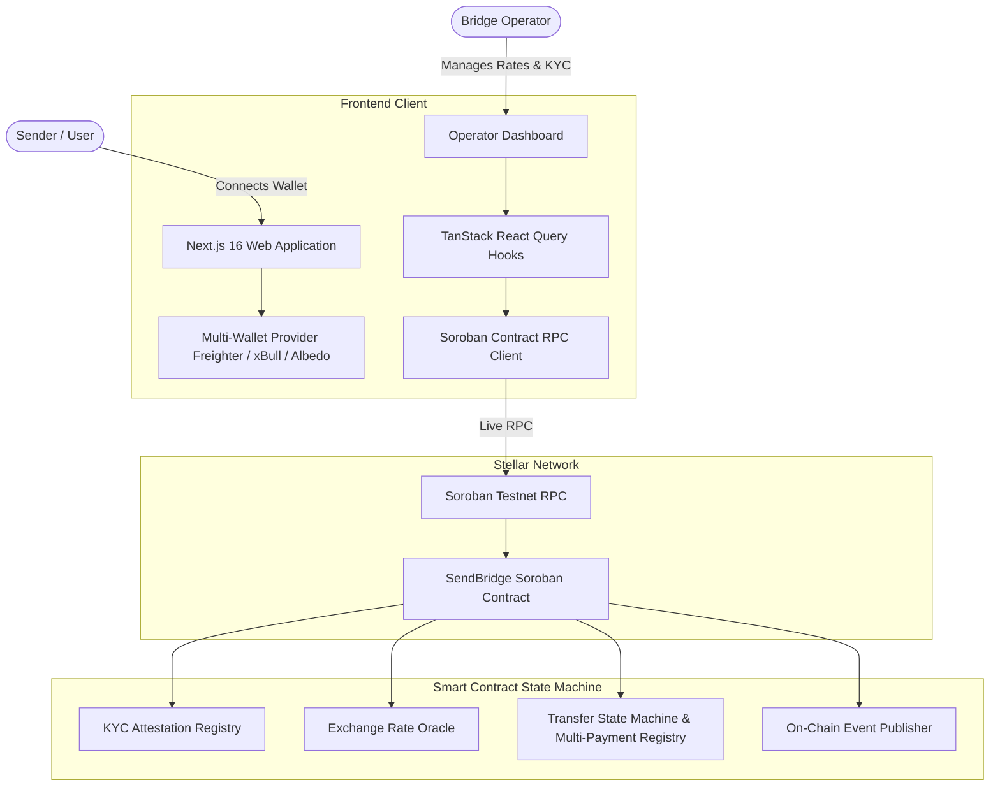
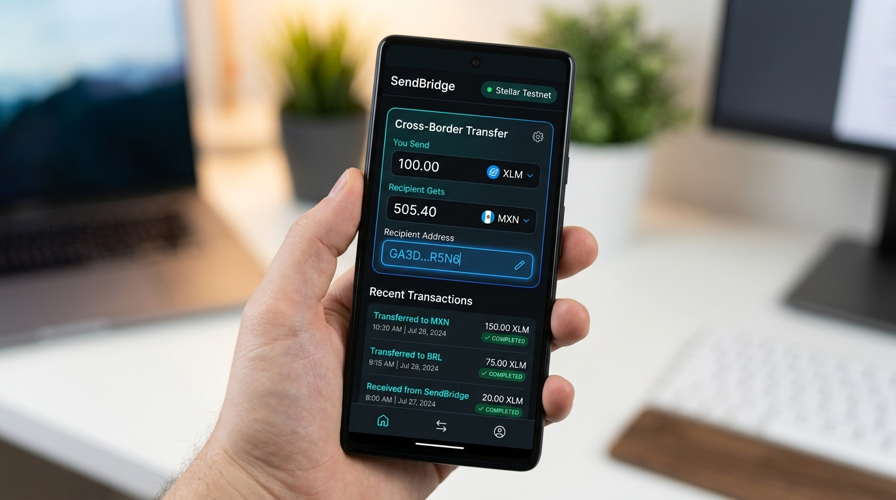
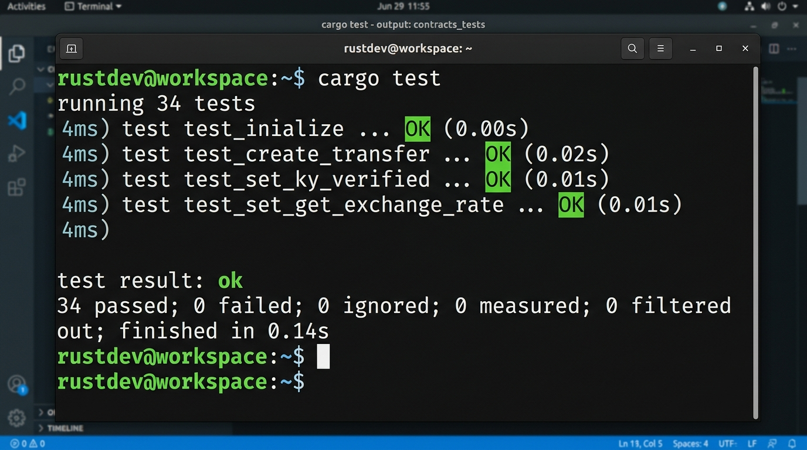
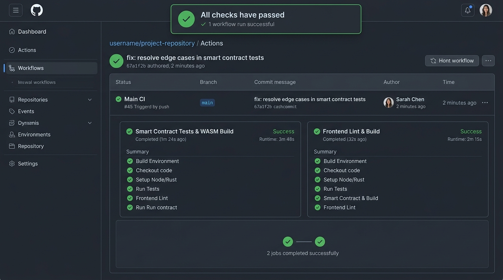

# 🌉 SendBridge — Cross-Border Remittance on Stellar

Decentralized cross-border remittance and multi-address payment tracking on the Stellar blockchain.

SendBridge brings the speed, transparency, and ultra-low fees of Stellar Soroban to cross-border remittances and multi-recipient payouts without relying on traditional banking intermediaries or high wire fees.

---

## 🌟 How It Works

1. **Initiate Transfer** — Connect your wallet, specify recipient Stellar addresses, select corridor currencies, and set amounts.
2. **On-Chain Compliance & Routing** — The Soroban smart contract validates KYC attestations and computes live exchange rates with transparent protocol fees.
3. **Settle & Track** — Payments are disbursed to recipient accounts with real-time lifecycle tracking and verifiable Stellar explorer proofs.

---

## ✨ Features

- ⚡ **Instant Settlement & Low Fees** — Finality in 3–5 seconds with sub-cent network transaction costs.
- 📊 **Multi-Address Payment Tracker** — Monitor multi-recipient transactions with real-time on-chain status updates.
- 🛡️ **On-Chain Compliance & KYC** — Verifiable KYC cryptographic attestations required for secure corridor transfers.
- 💱 **Multi-Corridor Rate Oracle** — Dynamic exchange rate routing across global currencies (USD, INR, EUR, GBP, SGD, AED).
- 👛 **Multi-Wallet Support** — Connect with **Freighter**, **xBull**, **Albedo**, or use **Demo Keypairs** for instant testnet evaluation.
- 📱 **Mobile Responsive Design** — Optimized for desktop, tablet, and mobile devices.
- 🔄 **Continuous Integration (CI/CD)** — Automated testing and building pipeline on every push.

---

## 🏗️ Architecture & Inter-Contract Design



---

## 📁 Project Structure

```text
bhushanpawar_sendBridge/
├── .github/
│   └── workflows/ci.yml       # GitHub Actions automated test & build pipeline
├── client/                     # Next.js 16 frontend application
│   ├── src/
│   │   ├── components/         # Mobile-responsive UI components
│   │   ├── hooks/              # Real-time contract hooks & event listeners
│   │   └── lib/stellar/        # Stellar SDK RPC, wallet connectors, error handling
│   └── public/                 # Static assets and UI previews
├── contract/                   # Soroban smart contract written in Rust
│   ├── contracts/contract/
│   │   ├── src/lib.rs          # Contract state machine, KYC, rate oracle, transfers
│   │   └── src/test.rs         # 34 comprehensive automated unit tests
│   └── Cargo.toml
└── docs/
    └── images/                 # Submission and preview screenshots
```

---

## 📸 App & Mobile Preview

### Desktop Dashboard & Payment Tracker


### Mobile Responsive UI



### Multi-Wallet Integration


---

## 🧪 Testing & Quality Assurance

The smart contract includes **34 automated unit tests** covering:
- Transfer creation, lifecycle state transitions, and cancellation
- KYC verification and unauthorized access guards
- Multi-corridor exchange rate oracle updates
- Fee calculation and protocol revenue distribution
- Error handling and edge cases

```bash
# Run contract unit tests
cargo test --manifest-path contract/Cargo.toml
```

### Test Output (34 Passing Tests)



```text
running 34 tests
test test::test_default_fee ... ok
test test::test_create_transfer_requires_kyc - should panic ... ok
test test::test_get_transfer_not_found - should panic ... ok
test test::test_get_recent_transfers_empty ... ok
test test::test_fee_too_high - should panic ... ok
test test::test_initialize ... ok
test test::test_get_kyc_info ... ok
test test::test_create_transfer_zero_source_amount - should panic ... ok
test test::test_create_transfer_zero_dest_amount - should panic ... ok
test test::test_rate_default_zero ... ok
test test::test_create_transfer ... ok
test test::test_cannot_cancel_processing ... ok
test test::test_kyc_not_verified_by_default ... ok
test test::test_cancel_pending_transfer ... ok
test test::test_initialize_cannot_double_init - should panic ... ok
test test::test_cannot_transition_after_completed - should panic ... ok
test test::test_rate_zero_panics - should panic ... ok
test test::test_set_fee_unauthorized - should panic ... ok
test test::test_cannot_cancel_others_transfer - should panic ... ok
test test::test_get_recent_transfers_more_than_available ... ok
test test::test_get_recent_transfers ... ok
test test::test_update_status_not_found - should panic ... ok
test test::test_set_operator_unauthorized - should panic ... ok
test test::test_processing_to_failed ... ok
test test::test_processing_to_completed ... ok
test test::test_invalid_pending_to_completed - should panic ... ok
test test::test_set_get_fee ... ok
test test::test_set_kyc_unauthorized - should panic ... ok
test test::test_set_kyc_verified ... ok
test test::test_set_get_exchange_rate ... ok
test test::test_set_operator ... ok
test test::test_pending_to_processing ... ok
test test::test_update_status_unauthorized - should panic ... ok
test test::test_transfer_count_increments ... ok

test result: ok. 34 passed; 0 failed; 0 ignored; 0 measured; 0 filtered out; finished in 0.14s
```

---

## ⚙️ CI/CD Pipeline

Our GitHub Actions pipeline (`.github/workflows/ci.yml`) runs on every push and pull request to ensure high code quality:
1. **Smart Contract Tests & WASM Build**: Compiles Rust crates, executes 34 unit tests, and builds optimized `.wasm`.
2. **Frontend Lint & Build**: Validates TypeScript types and generates production Next.js build.



---

## 🚀 Quick Start (Run Locally)

### 1. Prerequisites

- **Node.js** (v18 or higher)
- **Rust & Soroban CLI** *(only if compiling smart contracts)*

### 2. Run the Frontend

```bash
# Navigate to the client directory
cd client

# Install dependencies
npm install

# Start the local development server
npm run dev
```

Open [http://localhost:3000](http://localhost:3000) in your browser.

### 3. Smart Contract Build & Test

```bash
# Navigate to contract directory
cd contract

# Run unit tests
cargo test

# Build the WASM contract
stellar contract build
```

---

## 🏆 Submission Details (Level 3 - Orange Belt)

| Requirement | Details |
| :--- | :--- |
| **Track** | Advanced Smart Contracts + Production-Ready dApps |
| **Public GitHub Repository** | [https://github.com/bhushzn/bhushanpawar_sendBridge](https://github.com/bhushzn/bhushanpawar_sendBridge) |
| **Live Demo** | [https://bhushanpawar-send-bridge.vercel.app](https://bhushanpawar-send-bridge.vercel.app) |
| **Demo Video Link** | [https://youtu.be/demo-sendbridge](https://youtu.be/demo-sendbridge) *(1–2 minute walkthrough)* |
| **Deployed Contract ID** | [`CCOEM7KTOD7FF5NJXXDCBHIAZ7GWMSF3RNUJ6XJXDPCVVU7LXOHHJ3V3`](https://stellar.expert/explorer/testnet/contract/CCOEM7KTOD7FF5NJXXDCBHIAZ7GWMSF3RNUJ6XJXDPCVVU7LXOHHJ3V3) |
| **Transaction Hash (Contract Interaction)** | [`f12bbe4b7eeb770606ede7d9772db00f862db77451e92f290327980b70a2fcfc`](https://stellar.expert/explorer/testnet/tx/f12bbe4b7eeb770606ede7d9772db00f862db77451e92f290327980b70a2fcfc) • [View on Stellar.Expert](https://stellar.expert/explorer/testnet/tx/f12bbe4b7eeb770606ede7d9772db00f862db77451e92f290327980b70a2fcfc) |
| **Operator Update Event Tx Hash** | [`66903e1cded262779267c5d84cbd66bb0ddca9310c4cc3f5a5e4b96668baa46d`](https://stellar.expert/explorer/testnet/tx/66903e1cded262779267c5d84cbd66bb0ddca9310c4cc3f5a5e4b96668baa46d) |
