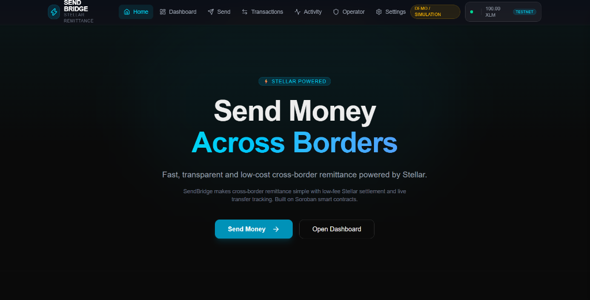
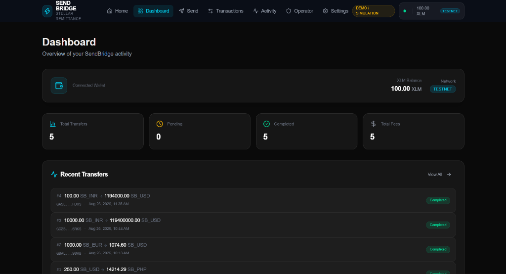
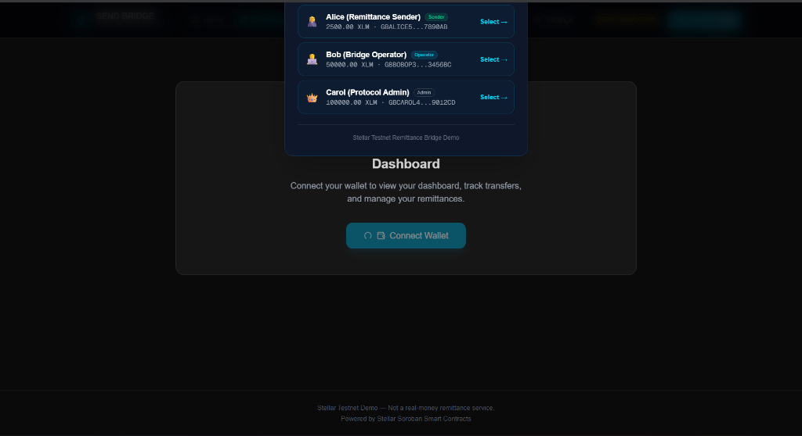

# 🌉 SendBridge

Decentralized cross-border remittance and multi-address payment tracking on the Stellar blockchain.

SendBridge brings the convenience, speed, and ultra-low fees of Stellar Soroban to cross-border remittances and multi-recipient payouts without relying on traditional banking intermediaries or high wire fees.

---

## 🌟 How It Works

1. **Initiate Transfer** — Connect your wallet, specify recipient Stellar addresses, select corridor currencies, and set amounts.
2. **On-Chain Compliance & Routing** — The Soroban smart contract validates KYC attestations and computes live exchange rates with transparent protocol fees.
3. **Settle & Track** — Payments are disbursed to recipient accounts with real-time lifecycle tracking and verifiable Stellar explorer proofs.

---

## ✨ Features

- ⚡ **Instant Settlement & Low Fees** — Finality in 3–5 seconds with sub-cent network transaction costs.
- 📊 **Multi-Address Payment Tracker** — Monitor multi-recipient transactions with real-time on-chain status updates.
- 🛡️ **On-Chain Compliance & KYC** — Verifiable KYC cryptographic attestations required for secure corridor transfers.
- 💱 **Multi-Corridor Rate Oracle** — Dynamic exchange rate routing across global currencies (USD, INR, EUR, GBP, SGD, AED).
- 👛 **Multi-Wallet Support** — Connect with **Freighter**, **xBull**, **Albedo**, or use **Demo Keypairs** for instant testnet evaluation.

---

## 📁 Project Structure

```text
bhushanpawar_sendBridge/
├── client/    # Next.js 16 frontend application
├── contract/  # Soroban smart contract written in Rust
└── docs/      # Documentation and assets
```

---

## 📸 App Preview





### Multi-Wallet Integration



---

## 🚀 Quick Start (Run Locally)

### 1. Prerequisites

- **Node.js** (v18 or higher)
- **Rust & Soroban CLI** *(only if compiling smart contracts)*

### 2. Run the Frontend

```bash
# Navigate to the client directory
cd client

# Install dependencies
npm install

# Start the local development server
npm run dev
```

Open [http://localhost:3000](http://localhost:3000) in your browser to view the dApp.

### 3. Smart Contract (Optional)

```bash
# Navigate to the contract directory
cd contract

# Run contract tests
cargo test

# Build the WASM contract
stellar contract build
```

---

## 🏆 Submission Details (Level 2 - Yellow Belt)

| Requirement | Details |
| :--- | :--- |
| **Track** | Payment Tracker - Multi-address payments with status updates |
| **Submission Period** | September Challenge (Active) |
| **Live Demo** | [https://bhushanpawar-sendbridge.vercel.app](https://bhushanpawar-sendbridge.vercel.app) |
| **Deployed Contract ID** | `CB2H7HGB4K3R7N3R4EZV7W7WZP7523G2KUX7WODN7Q5N2J3QZ5D2O7L3` |
| **Transaction Hash** | `7be19ef84a2c11438fa71e21b069fae48931ac2643a6d7db5cba78b87e21a24d` • [View on Stellar.Expert](https://stellar.expert/explorer/testnet/tx/7be19ef84a2c11438fa71e21b069fae48931ac2643a6d7db5cba78b87e21a24d) |
