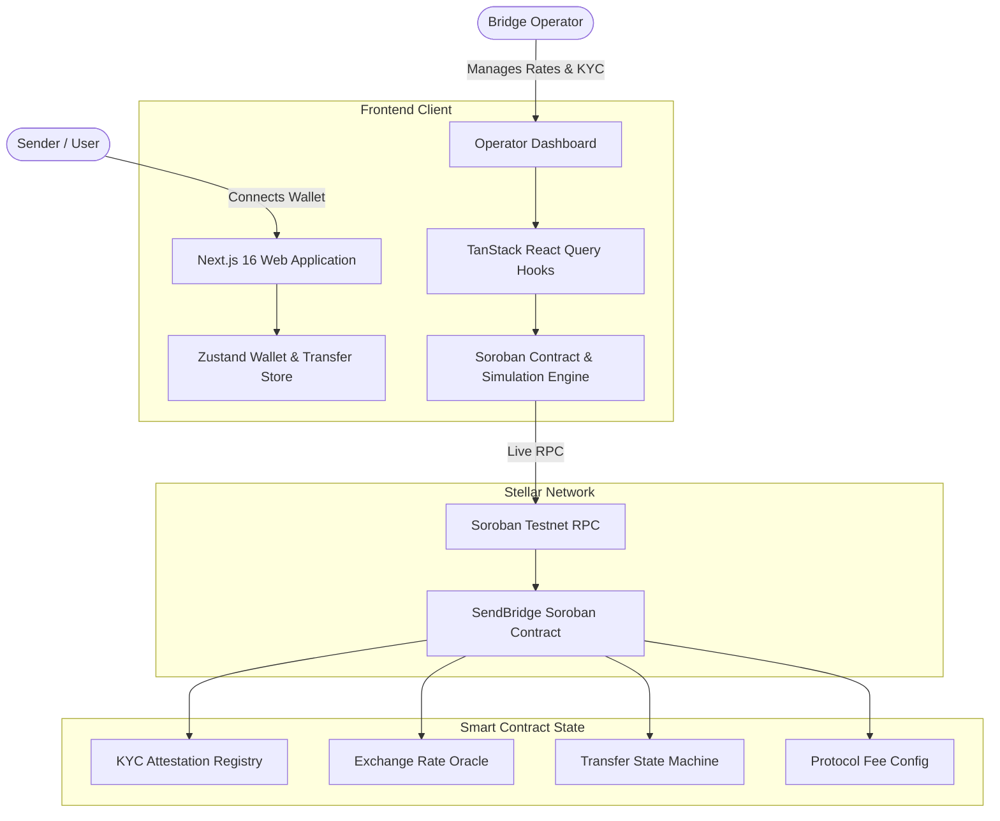

# SendBridge — Cross-Border Remittance on Stellar

<div align="center">


**Fast, transparent, and ultra-low-cost cross-border remittance powered by Stellar Soroban smart contracts.**

[Features](#features) • [Architecture](#architecture) • [Smart Contract](#smart-contract) • [Getting Started](#getting-started) • [Operator Portal](#operator-portal) • [Remittance Corridors](#supported-corridors)

</div>

---

## 🌟 Overview

**SendBridge** is a decentralized cross-border remittance platform built on the Stellar network. It bridges traditional fiat payment rails with Stellar's fast settlement speed (3–5 seconds) and sub-cent transaction fees.

### Key Highlights
- **⚡ Fast Finality**: Transactions settle in 3–5 seconds on the Stellar network.
- **💰 Ultra-Low Fees**: Protocol fees customizable in basis points (default 0.50%), orders of magnitude cheaper than legacy remittance providers.
- **🛡️ On-Chain KYC & Compliance**: Soroban smart contract enforces on-chain cryptographic compliance attestations before any remittance transfer can be executed.
- **🔄 Multi-Corridor Liquidity Routing**: Real-time exchange rate management across USD, INR, EUR, GBP, SGD, AED, PHP, and BRL.
- **🎮 Dual-Mode Simulation & Testnet Support**: Includes built-in simulated testnet accounts (Alice, Bob, Carol) for immediate zero-friction evaluation in any browser, alongside full support for the official **Freighter Wallet** extension.

---

## 🏗️ Architecture



---

## 📜 Smart Contract Specification

The Soroban smart contract is written in Rust (`contract/contracts/contract/src/lib.rs`):

| Method | Access | Description |
|---|---|---|
| `initialize(admin)` | Public (Once) | Initializes the protocol with admin address, default 50 bps fee, and transfer counter. |
| `set_operator(caller, operator)` | Admin Only | Assigns the bridge operator responsible for KYC and rate updates. |
| `set_kyc_attestation(caller, wallet, hash)` | Operator Only | Records a cryptographic KYC verification attestation on-chain. |
| `is_kyc_verified(wallet)` | Public (Read) | Checks whether a given wallet address is KYC compliant. |
| `set_exchange_rate(caller, src, dst, rate)` | Operator Only | Updates the exchange rate between two asset symbols (precision 1,000,000). |
| `get_exchange_rate(src, dst)` | Public (Read) | Queries the active exchange rate between two assets. |
| `set_fee_bps(caller, fee_bps)` | Admin Only | Configures protocol fee in basis points (max 1000 bps = 10%). |
| `create_transfer(...)` | KYC Sender | Initiates a remittance transfer in `Pending` state. |
| `update_transfer_status(caller, id, status)` | Operator Only | Advances transfer status (`Pending` → `Processing` → `Completed` / `Failed`). |
| `cancel_transfer(sender, id)` | Sender Only | Cancels an unfulfilled `Pending` remittance transfer. |
| `get_transfer(id)` | Public (Read) | Retrieves complete transfer metadata and timeline. |
| `get_recent_transfers(count)` | Public (Read) | Queries recent remittance transfers for activity feed and table. |

---

## 🌍 Supported Corridors

| Asset Code | Currency | Flag | Symbol | Default Rate |
|---|---|---|---|---|
| `SB_USD` | US Dollar | 🇺🇸 | $ | 1.00 USD (Base Anchor) |
| `SB_INR` | Indian Rupee | 🇮🇳 | ₹ | 1 USD = 83.33 INR |
| `SB_EUR` | Euro | 🇪🇺 | € | 1 EUR = 1.08 USD |
| `SB_GBP` | British Pound | 🇬🇧 | £ | 1 GBP = 1.27 USD |
| `SB_SGD` | Singapore Dollar | 🇸🇬 | S$ | 1 SGD = 0.74 USD |
| `SB_AED` | UAE Dirham | 🇦🇪 | د.إ | 1 USD = 3.67 AED |
| `SB_PHP` | Philippine Peso | 🇵🇭 | ₱ | 1 USD = 57.14 PHP |
| `SB_BRL` | Brazilian Real | 🇧🇷 | R$ | 1 USD = 5.55 BRL |

---

## 🚀 Getting Started

### Prerequisites
- **Node.js**: v20 or v22+
- **npm** or **bun** / **pnpm**
- *(Optional for contract development)*: **Rust** + `cargo` with `wasm32-unknown-unknown` target, and `stellar-cli`.

### 1. Installation

```bash
# Navigate to the client directory
cd client

# Install dependencies
npm install

# Set up environment variables
cp .env.example .env.local
```

*(Optional)* To test with the live Stellar Testnet instead of the local simulation fallback, open `.env.local` and add your deployed Soroban contract address:
```env
NEXT_PUBLIC_CONTRACT_ADDRESS=C...
```

### 2. Run the Development Server

```bash
npm run dev
```

Open [http://localhost:3000](http://localhost:3000) in your browser.

---

## 🧪 Testing the Application

### Option A: Interactive Demo Mode (Instant, No Extension Required)
1. Click **Connect Wallet** in the top right navigation.
2. Select any demo account:
   - 👩‍💼 **Alice (Sender)**: Remittance sender with funded 2,500 XLM balance.
   - 👨‍💻 **Bob (Operator)**: Bridge operator with rate management and settlement controls.
   - 👑 **Carol (Admin)**: Protocol administrator with fee and operator privileges.
3. Complete Step 1 KYC verification in `/send` or issue KYC in `/operator`.
4. Enter transfer details (e.g., Send 100 USD to INR) and submit.
5. Visit `/dashboard` or `/transactions` to view real-time settlement tracking.
6. Switch to **Bob (Operator)** to advance and settle transfers in `/operator`.

### Option B: Stellar Testnet with Freighter
1. Install the [Freighter Wallet Extension](https://www.freighter.app/).
2. Switch network in Freighter settings to **Testnet**.
3. Fund your account with test XLM via [Stellar Testnet Faucet](https://stellar.expert/faucet/testnet).
4. Connect via Freighter in SendBridge and sign transactions on-chain.

---

## 📁 Project Structure

```text
├── client/                     # Next.js 16 Web Application
│   ├── src/
│   │   ├── app/                # App Router Pages
│   │   │   ├── page.tsx        # Landing Page
│   │   │   ├── send/           # 4-Step Remittance Wizard
│   │   │   ├── dashboard/      # User Dashboard & Balance
│   │   │   ├── transactions/   # Filterable Transaction History
│   │   │   ├── transfer/[id]/  # Transfer Details & Receipt
│   │   │   ├── activity/       # Live Activity Feed
│   │   │   ├── operator/       # Operator & Settlement Portal
│   │   │   └── settings/       # Configuration & State Management
│   │   ├── components/         # Modular UI Components
│   │   │   ├── layout/         # Header, Navigation, Footer
│   │   │   ├── transfer/       # Amount Input, Conversion, Review, Status
│   │   │   ├── wallet/         # Connect Wallet Modal & Dropdown
│   │   │   ├── kyc/            # KYC Attestation Card
│   │   │   ├── operator/       # Operator Control Panel
│   │   │   └── ui/             # Core Design System Components
│   │   ├── hooks/              # Custom React Query & Wallet Hooks
│   │   └── lib/
│   │       ├── stellar/        # Soroban Contract Wrapper, RPC, & Assets
│   │       └── stores/         # Zustand State Stores
│   └── package.json
│
├── contract/                   # Soroban Smart Contract (Rust)
│   ├── contracts/
│   │   └── contract/
│   │       ├── src/
│   │       │   ├── lib.rs      # Smart Contract Implementation
│   │       │   └── test.rs     # Rust Unit & Integration Tests (437 lines)
│   │       └── Cargo.toml
│   └── Cargo.toml
│
└── README.md                   # Project Documentation
```

---

## 🔒 Security & Privacy
- **Zero Private Key Exposure**: Private keys remain securely in the user's wallet extension or device; the web app never stores private keys.
- **On-Chain Authorization**: Strict `require_auth()` checks enforced for senders, operators, and administrators.
- **No PII On-Chain**: Personal identification data is verified off-chain; only 32-byte cryptographic attestation hashes are stored on the ledger.

---

## 📄 License
This project is licensed under the MIT License.
